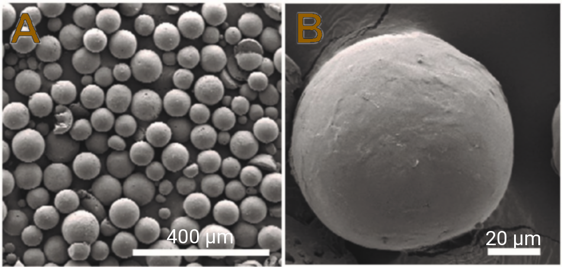
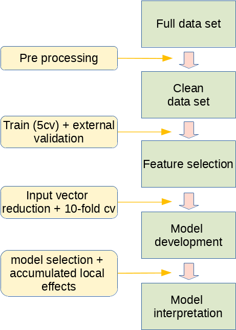

<style type="text/css">

h1 {
  color: steelblue;
}

h2 {
  color: steelblue;
}

h3 {
  color: steelblue;
}

</style>


## 1. Introduction
This is an [R Markdown](http://rmarkdown.rstudio.com) Notebook. If you wish to run or edit the notebook, please use RStudio to open the .Rmd file. You can also run the example in the R console.  

### Installation of R (and Rstudio)  
The R environment and Rstudio is available for the Windows, OS X (Mac) and Linux. In order to install `R` please visit the link https://cran.r-project.org/ then chose on of the following options:

  - Linux  
  R is available through most Linux package managers. You can download the binary files for your distribution from CRAN. Or you can use your package manager (e.g. for Debian/Ubuntu run `sudo apt-get install r-base` and for Fedora run `sudo yum install R`). If your package manager doesn't contain `R-base` of `r-base` pacakge, please chose your distribution and follow the instructions at CRAN webpage.   
 - OS X (Mac)  
   - Go to CRAN and click on Download R for (Mac) OS X https://cran.r-project.org/bin/macosx/
   - Select the .pkg file for the version of OS X that you have and the file will download.
   - Double click on the file that was downloaded and R will install.
 - Windows 
   - Download R for Windows https://cran.r-project.org/bin/windows/base/  
   - Run the .exe file that was downloaded in the step above.  
   
In order to install Rstudio please go to the https://rstudio.com/products/rstudio/download/#download find your operating system and download appriopriate installer (exe, dmg, deb or rpm). Once it’s downloaded, double click the file to install it.  

### The data set  

  Poly(lactic-co-glycolic acid) (PLGA) is a polymer which is wiedly used in the medical application. PLGA is flexible and has a satisfactory safety profile. It can be used to manufacture therapeutic devices such as implants or it may serve as a drug carrier. 
  
```{r fig1, fig.cap="Figure 1. SEM image of a PLGA microparticles [1]", echo = FALSE}
# All defaults

``` 
  
These drug delivery systems (DDS) have a potential to transport both, small API (hydrophilic or hydrophobic). PLGA-based multiparticulate dosage forms are usually prepared as microspheres where the size varies from 5 to 100 μm, depending on the route of administration. 

  1. API chemical descriptors  
  2. experimental conditions (PLGA inherent viscosity, PLGA molecular weight, Lactide to Glycolide ratio, inner and outer phase PVA concentration, PVA molecular weight, inner phase volume, encapsulation rate, PLGA concentration, and production method
  3. plasticizer chemical descriptors
  4. emulsifier chemical descriptors
  
The ultimate goal of the model development was to built an accurate model predicting the size of obtained particles based on assay conditions and constituents. It would speed up development of tailored formulations. Therefore, development of such model, in perspective, could make the formulation process less time- and resource consuming.

[1] Dutta D, Fauer C, Salifu M and Stabenfeldt SE (2016). Synthesis of layered PLGA-PLA microparticles for tunable delayed protein release. Front. Bioeng. Biotechnol. Conference Abstract: 10th World Biomaterials Congress. doi: 10.3389/conf.FBIOE.2016.01.00105

### The workflow

The general scheme of the proposed workflow is presented below.

```{r fig2, fig.cap="Figure 2. General workflow of the case.", echo = FALSE}
# All defaults

``` 

### H2O and AutoML

H2O is an Open Source computational platform which implements many popular algorithms such as GBM, Random Forest, Deep Neural Networks, Word2Vec and Stacked Ensembles. H2O uses many popular interfaces like R, Python, Scala, Java, Flow etc. Under the hood H2O is written in Java, so JDK or JRE is one of its requirements. Please go to the http://docs.h2o.ai/h2o/latest-stable/h2o-docs/welcome.html# for more information.  
To install H2O in R, run your R console (for linux users who want the package to be available for all users please type `sudo R`) and then type lines listed below:  

```{r eval=FALSE, include=TRUE}

if ("package:h2o" %in% search()){
  detach("package:h2o", unload=TRUE)
}

if ("h2o" %in% rownames(installed.packages())){
  remove.packages("h2o")
}  

# install dependencies
pkgs <- c("RCurl","jsonlite")
for (pkg in pkgs) {
  if (! (pkg %in% rownames(installed.packages()))) { install.packages(pkg) }
}

install.packages("h2o", type="source", repos=(c("http://h2o-release.s3.amazonaws.com/h2o/latest_stable_R")))

```

It is also possible to install H2O without specifing the repository, because it is on CRAN (https://cran.r-project.org/web/packages/h2o/index.html).

### Model interpretation by the Acumulated Local Effects
In this exaple we will be using ALE interpretation to reveal what is behind our predictions. Accumulated local effects describe how features influence the prediction of a machine learning model on average. We won't be going deep into the theory. We will try to apply ALE plots to our case and try to get a general idea what infuence the predictions of our model. For this purpose we will use `iml` package https://cran.r-project.org/web/packages/iml/vignettes/intro.html
ALE plots: “Let me show you how the model predictions change in a small”window" of the feature around v for data instances in that window."  
Advantages:
 - unbiased, compared to Partial Dependence Plots
 - faster to compute than PDPs
 - clear interpretation  
Disadvantages:
 - plots can be ragged when a high number of intervals occurs
 - varying stability across the feature space (estimates have a different accuracy)

For reference please read great book "Interpretable Machine Learning" by Christoph Molnar:
https://christophm.github.io/interpretable-ml-book/

[1] Molnar, Christoph. "Interpretable machine learning. A Guide for Making Black Box Models Explainable", 2019. https://christophm.github.io/interpretable-ml-book/.

## 2. The case

### Requirements
First we will load necessary libraries. The case needs following packages: `corrplot`, `devtools`, `DT`, `dplyr`, `ggplot2`, `Hmisc`, `h2o`, `iml`, `knitr` (the last package is needed in case you want to run the example in RStudio). If you don't have them installed already, you can do it by typing in the R console:

```{r eval=TRUE, message=FALSE, include=TRUE, warning=FALSE}
caseLibraries = c("corrplot", "devtools", "DT", "dplyr", "ggplot2", "Hmisc", "h2o", "iml")

# install.packages(caseLibraries)

installCaseLibs = function(x) {
  for(i in 1:length(x)){
    if((x[i] %in% .packages(all.available=TRUE)) == TRUE) {
      eval(parse(text=paste("require(", x[i], ")", sep="")))
    } else {
      eval(parse(text=paste("install.packages('", x[i], "')", sep="")))
    }
  }
}

installCaseLibs(caseLibraries)

```

### Pre processing
Then we will load the data and see what is its structure.

```{r dataset}
myWorkDir = getwd()
myFilename = "MPS_PLGA_295in.csv"
myDataset = read.csv(paste(myWorkDir,"/dataset/",myFilename,sep=""),
                     sep=",", header = TRUE, row.names = 1)
DT::datatable(head(myDataset), 
              options = list(fontsize = 10, scrollCollapse = FALSE, scrollY = 225),
              fillContainer = TRUE)
```

The data is in MISO format (Multiple Input Single Output) and the output variable is in the last column.

```{r}
outputIndex = ncol(myDataset)
boxplot(myDataset[outputIndex],main="Output boxplot", ylab = colnames(myDataset)[outputIndex])
```

Now we can see that there are 3 record which clearly differ in terms of `Mean_part_size` from the rest. Though, we won't remove those records because we want as many data as possible. 

```{r include=FALSE}
lessOutliers = myDataset
```

If you decide to do so, R makes it easy to delete rows as we can use the `subset()` function to create a new version of our `data.frame()`. Just run the code below.

```{r removeOutliers, eval = FALSE, echo=TRUE, message=FALSE, warning=FALSE, paged.print=FALSE}
# ## Not-to_run
# lessOutliers = subset(myDataset, myDataset[outputIndex]<150)
# boxplot(lessOutliers[outputIndex],main='Output boxplot', ylab = colnames(lessOutliers)[outputIndex])
# 
# rowsNo1 = nrow(myDataset)
# rowsNo2 = nrow(lessOutliers)
# 
# print(paste("No of rows BEFORE outliers deletion: ", rowsNo1))
# print(paste("No of rows AFTER outliers deletion: ", rowsNo2))

```

Now we can check if columns have unique values (zero-variance variables) across all rows. Those constant values when used while developing a model, can cause problems like unstable models or in some cases, can negativly affect the outcome. Therefore, we will use `var()` function to calculate variance column-wise.

```{r}
# We are just indexing column-wise columns that have 0 variance
names(lessOutliers[, sapply(lessOutliers, function(v) var(v, na.rm=TRUE)==0)])
myDatasetClean = lessOutliers[,sapply(lessOutliers, function(v) var(v, na.rm=TRUE)!=0)]

print(paste("Dim (rows x cols) BEFORE data checking: ", dim(lessOutliers)[1], " x ", dim(lessOutliers)[2]))
print(paste("Dim (rows x cols) AFTER data checking: ", dim(myDatasetClean)[1], " x ", dim(myDatasetClean)[2]))
```

As we see, there are no columns with zero variance. Nevertheless, some columns that have so called near-zero-variance may become zero-variance predictors if the data are split. We will adapt a function from caret package (https://github.com/topepo/caret/blob/master/pkg/caret/R/nearZeroVar.R) to identify and eliminate those inputs prior to modeling.  
To identify near-zero-variables, the following two metrics can be calculated:
  - the frequency of the most prevalent value over the second most frequent value (called the “frequency ratio"), which would be near one for well-behaved predictors and very large for highly-unbalanced data  
  - the “percent of unique values", which is the number of unique values divided by the total number of samples (times 100); it approaches zero as the granularity of the data increases  
If the frequency ratio is greater than a pre-specified threshold and the unique value percentage is less than a threshold, we might consider a predictor to be near zero-variance. Using both criteria we should not falsely delete values.

```{r}
# Original code from https://github.com/topepo/caret/blob/master/pkg/caret/R/nearZeroVar.R

nzv <- function (x, freqCut = 95/5, uniqueCut = 10, saveMetrics = FALSE, names = FALSE)
{
  if (is.null(dim(x))) x <- matrix(x, ncol = 1)
  freqRatio <- apply(x, 2, function(data)
  {
    t <- table(data[!is.na(data)])
    if (length(t) <= 1) {
      return(0);
    }
    w <- which.max(t);
    return(max(t, na.rm=TRUE)/max(t[-w], na.rm=TRUE))
  })
  lunique <- apply(x, 2, function(data) length(unique(data[!is.na(data)])))
  percentUnique <- 100 * lunique / apply(x, 2, length)
  zeroVar <- (lunique == 1) | apply(x, 2, function(data) all(is.na(data)))
  if (saveMetrics)
  {
    out <- data.frame(freqRatio = freqRatio,
                      percentUnique = percentUnique,
                      zeroVar = zeroVar,
                      nzv = (freqRatio > freqCut & percentUnique <= uniqueCut) | zeroVar)
  }
  else {
    out <- which((freqRatio > freqCut & percentUnique <= uniqueCut) | zeroVar)
    names(out) <- NULL
    if(names){
      out <- colnames(x)[out]
    }
  }
  out
}

nzv(myDatasetClean, names = TRUE, saveMetrics = TRUE)

```

Now we will apply the `nzv()` function to our `myDatasetClean` data.frame:

```{r}
nearZeroVarianceIndex = nzv(myDatasetClean)
filteredMyDatasetClean = myDatasetClean[, -nearZeroVarianceIndex]
dim(myDatasetClean)
dim(filteredMyDatasetClean)
```

As it is clearly seen. We have reduced the number of inputs from 295 (the 296 is because we have added the output) to 208.  
Now we will create a dunction to get the descriptive statistics from our data. It is also possible to use the base R function `summary()`.

```{r}
mySummary <- function(x,...){
  c(min=min(x, ...),
    "1st_Qu"=quantile(x, 0.25, names = FALSE),
    "2nd_Qu"=quantile(x, 0.5, names = FALSE),
    "3rd_Qu"=quantile(x, 0.75, names = FALSE),
    mean=round(mean(x, ...),3),
    sd=round(sd(x, ...),3),
    median=median(x, ...),
    max=max(x,...), 
    n=length(x))
}

myDataSummary = sapply(myDatasetClean, mySummary)

DT::datatable(myDataSummary, 
              options = list(pageLength = 9, fontsize = 10, scrollCollapse = FALSE, scrollY = 350),
              fillContainer = TRUE)

```

Next we will examine linear correlations, based on the correlation plot. We will also combine the correlogram with the significance test (p-value). Therefore, we will use package `corrplot` and `Hmisc`. We will grab only the variables which respresent formulation characteristics. That is why we create an index of columns with pattern `.*Form_char.*`.

```{r fig.cor, fig.height = 7, fig.width = 7, fig.align = "center"}

formCharIndex = grep(".*Form_char.*", colnames(filteredMyDatasetClean))
formCharData = filteredMyDatasetClean[,c(formCharIndex, ncol(filteredMyDatasetClean))]

corrRes = Hmisc::rcorr(as.matrix(formCharData))

corrplot::corrplot(corrRes$r, type="upper", order="hclust", 
         p.mat = corrRes$P, sig.level = 0.01, insig = "blank",
         tl.cex = 0.7, tl.col = 'black', number.cex=0.6,
         addCoef.col="black", addCoefasPercent = FALSE)

```


First we `set.seed()` in order to get reproducible results. In the code below we shuffle the rows using `sample()` function.
```{r random}
set.seed(11111)

# Randomly shuffle the data - we are doing this only once in order to maintain the data structure 
shuffledFilteredMyDatasetClean = filteredMyDatasetClean[sample(nrow(filteredMyDatasetClean)),]

```

In order to fit our data to the linear model, we will split data into training-testing with the ratio of 70:30. To build a linear regression model we will use the function `lm()`. Let's see what are the results.

```{r lm_model, echo=TRUE}

trainingRowIndex <- seq(1,0.7*nrow(shuffledFilteredMyDatasetClean))  # row indices for training data
trainingData <- shuffledFilteredMyDatasetClean[trainingRowIndex, ]  # model training data
testData  <- shuffledFilteredMyDatasetClean[-trainingRowIndex, ]   # test data

linearMod <- lm(Mean_part_size ~. , data=trainingData)  # build linear regression model on full data

head(na.omit(coef(summary(linearMod)))) %>%
  DT::datatable() %>%
  DT::formatRound(columns=colnames(coef(summary(linearMod))), digits=3)
```

We will also define a function RMSE to asses the results. Let's see what is the performance of the model.

```{r warning=FALSE}
# Define RMSE function
RMSE = function(m, o){
  sqrt(mean((m - o)^2))
}

# First predict the results on testing data, then calculate RMSE
myPredLM = predict(linearMod, testData)

myRMSE = RMSE(myPredLM, testData[,ncol(testData)])

cat("\n", "RMSE on testing data: ", myRMSE)
```

Ok, let's try to built a model according to the "gold standard" which is the 10-fold cross validation. We will see what is its performance (RMSE). Please, be advised of the names which will be used.

```{r 10cv_orig, warning=FALSE}

# get my current directory
myCurrentDir=getwd()

# Base name
myBasename = "MPS_PLGA"

# create export dir, where orig 10-cv data sets will be stored
my10cvOrigDir = paste(myCurrentDir,"/10cv_orig",sep="")
dir.create(my10cvOrigDir, showWarnings = FALSE)

foldsNo = 10

#Create 10 equally size folds
folds = cut(seq(1,nrow(shuffledFilteredMyDatasetClean)),breaks=foldsNo,labels=FALSE)

# Create RMSE matrix
rmse_tab = matrix(data=NA,nrow=foldsNo)

options(warn = -1)
# Perform 10-fold cross validation
for(i in 1:10){
    # Segement your data by fold using the which() function 
    testIndicies = which(folds==i,arr.ind=TRUE)
    testData = shuffledFilteredMyDatasetClean[testIndicies, ]
    trainData = shuffledFilteredMyDatasetClean[-testIndicies, ]
    
    # We will save the 10-cv folds in order to use them later
    write.csv(trainData,
              file = paste(my10cvOrigDir,"/",myBasename,"_",(dim(trainData)[2]-1),"in_no_",i,".txt",sep=""),
              quote=FALSE, row.names = TRUE)
    write.csv(testData,
              file = paste(my10cvOrigDir,"/","t-",myBasename,"_",(dim(testData)[2]-1),"in_no_",i,".txt",sep=""),
              quote=FALSE, row.names = TRUE)
    
    # Build the model on training data -
    lmMod = lm(Mean_part_size ~. , data=trainData)  # build the model
    meanPartSizePred = predict(lmMod, testData)  # predict distance
    obs_pred = data.frame(cbind(observed=testData$Mean_part_size, predicted=meanPartSizePred))  # make obs_pred dataframe.
    
    rmse_tab[i,] = RMSE(obs_pred$predicted, obs_pred$observed)
    
}

cat("\n", "Mean 10-cv RMSE = ", mean(rmse_tab))
```

The mean prediction on the 10-cv is really poor. Therefore, it can be stated that the input vector (208) is too numerous or we have to apply non-linear model in order to achieve better predictions. We will perform feature selection and see if this will help our `lm()` models.  

### H2O feature selection
Let's start by initializaing the h2o server. We will specify only few options like `myExportDir`, where the intermediate models will be stored, `myCores` - number of used cores, `memFreeG` - free RAM.

```{r h2o_init}

# create export dir, where h2o models will be stored
myExportDir=paste(myCurrentDir,"/export",sep="")
dir.create(myExportDir, showWarnings = FALSE)

# Detect the number of cores available - 1
myCores = parallel::detectCores(all.tests = TRUE) - 1

 
# Set memory which will be available to the server (in GB)
memFreeG = 12

#start_server
localH2O <- h2o::h2o.init(nthreads=myCores,
                          min_mem_size=paste(memFreeG,"g",sep=""),
                          max_mem_size=paste(memFreeG,"g",sep=""),
                          ice_root=myExportDir)

```

Now we will push our training-testing (70:30 ratio) into `H2OFrame` and built autoML model. We have specified `max_runtime_secs = 5*60` - this is the main parameter which is responsible for the duration of training - the more time the more models - of course all depends on the machine resources. Moreover, without setting `nfolds`, the default option is to build models based on 5-cv taken from the training data set. So, our `leaderboard_frame` will be an external validation data set. Be advised that we have turned off `StackedEnsemble` models. This is because feautre importance extraction from these models is much more complex - I will show you how to achieve that during the next case (Python).

```{r feature_selection}

  train.hex = as.h2o(trainingData)
  test.hex = as.h2o(testData)
  
  predictors <- 2:(ncol(train.hex)-1)
  response <- ncol(train.hex)
  
  amlFS = h2o::h2o.automl(y = response,
                     x = predictors,
                     training_frame = train.hex,
                     leaderboard_frame = test.hex,
                     keep_cross_validation_models = TRUE,
                     keep_cross_validation_predictions = TRUE,
                     keep_cross_validation_fold_assignment = TRUE,
                     max_runtime_secs = 5*60,
                     max_models = NULL,
                     exclude_algos = c("StackedEnsemble"),
                     export_checkpoints_dir=myExportDir,
                     seed = 1234,
                     project_name = "RandomPorject",
                     sort_metric = "RMSE")
  
  fsModel = h2o.getModel(amlFS@leader@model_id)
  fsRMSE = h2o.rmse(h2o.performance(fsModel, newdata = test.hex))
  
  
```

Now, let's see the leaderboard.

```{r}
amlFS@leaderboard
```

Here we will create a directory where h2o FS model will be stored.

```{r}
# create export dir, where h2o FS model will be stored
myFSDir = paste(myCurrentDir,"/FS_model",sep="")
dir.create(myFSDir, showWarnings = FALSE)
h2o.saveModel(h2o.getModel(amlFS@leader@model_id), path=myFSDir, force = TRUE)

```

Now, let's see feature importance table filtered accroding to the selected threshold.

```{r}

featureSelectionThreshold = 0.05 # scaled importance range from 0 to 1.0 - usually takes a value of 0.01 or 0.05

fsTable = as.data.frame(amlFS@leader@model$variable_importances)

filteredFSTable = fsTable[fsTable$scaled_importance > featureSelectionThreshold,]

filteredFSTable

```

The feature importance bar plot.

```{r}

filteredFSTable %>%
  dplyr::mutate(variable, scaled_importance) %>% ggplot2::ggplot(aes(y=scaled_importance, x=reorder(variable, scaled_importance))) +
  geom_bar(stat="identity", fill = "steelblue")+
  labs(x="variable")+
  theme_minimal()+
  coord_flip()

```

Now we will select only inputs that are listed in `filteredFSTable` `data.frame` and the output `outputName`. 

```{r}
outputName = colnames(shuffledFilteredMyDatasetClean)[ncol(shuffledFilteredMyDatasetClean)]

# remove inputs according to the feature selection
myDatasetFS = shuffledFilteredMyDatasetClean[c(filteredFSTable$variable,outputName)]

```

We will perform once again `lm()` inline with saving the 10-fold training-testing pairs.

```{r 10cv_FS}

# create export dir, where h2o FS model will be stored
my10cvFSDir = paste(myCurrentDir,"/10cv_FS",sep="")
dir.create(my10cvFSDir, showWarnings = FALSE)

# Numer of folds
foldsNo_FS = 10

# Create RMSE matrix
rmse_tab_FS = matrix(data=NA,nrow=foldsNo_FS)

# Create 10 equally size folds
folds_FS = cut(seq(1,nrow(myDatasetFS)),breaks=foldsNo_FS,labels=FALSE)

# Create 10-fold cross validation splits

for(i in 1:10){
    # Segement your data by fold using the which() function 
    testIndicies_FS = which(folds_FS==i,arr.ind=TRUE)
    testData_FS = myDatasetFS[testIndicies_FS, ]
    trainData_FS = myDatasetFS[-testIndicies_FS, ]
    
    # We will save the 10-cv folds in order to use them later
    write.csv(trainData_FS,
              file = paste(my10cvFSDir, "/", myBasename,"_",(dim(trainData_FS)[2]-1),"in_no_",i,".txt",sep=""),
              quote=FALSE, row.names = TRUE)
    write.csv(testData_FS,
              file = paste(my10cvFSDir, "/","t-",myBasename,"_",(dim(testData_FS)[2]-1),"in_no_",i,".txt",sep=""),
              quote=FALSE, row.names = TRUE)
    
    # Build the model on training data -
    lmModFS = lm(Mean_part_size ~. , data=trainData_FS)  # build the model
    meanPartSizePredFS = predict(lmModFS, testData_FS)  # predict distance
    obs_pred_FS = data.frame(cbind(observed=testData_FS$Mean_part_size, predicted=meanPartSizePredFS))  # make obs_pred dataframe.
    
    rmse_tab_FS[i,] = RMSE(obs_pred_FS$predicted, obs_pred_FS$observed)
    
}

cat("\n", "Mean 10-cv RMSE after FS = ", mean(rmse_tab_FS))

```
Well, our feature selection helped our `lm()` model a lot! We have reduced 10-cv RMSE from 68 to 33.

### Building a model according to the 10-fold cross validation
Ok, let's see if autoML can beat the score. First we will create stack all folds in one `data.frame`, but we will store fold number in separate column.

```{r}

test.files.list <- list.files(path="./10cv_FS/", pattern = paste("t-",myBasename,"*", sep = ""))

stratified.database.for.h2o <- data.frame()

for(i in 1:length(test.files.list)){

    tmp.fold = read.csv(file=paste("./10cv_FS/",test.files.list[i],sep=""), sep=",", header = TRUE, row.names = 1)
    matches = regmatches(test.files.list[i], gregexpr("[[:digit:]]+", test.files.list[i]))
    which.fold = as.numeric(matches[[1]][2])
    which.fold <- as.numeric(which.fold)
    
    tmp.fold <- cbind(which.fold,tmp.fold)
    
    stratified.database.for.h2o <- rbind(stratified.database.for.h2o,tmp.fold)
}

stratified.database.for.h2o <- stratified.database.for.h2o[order(stratified.database.for.h2o$which.fold),]

train.hex <- as.h2o(stratified.database.for.h2o)


predictors <- 2:(ncol(train.hex)-1)
response <- ncol(train.hex)

as.data.frame(train.hex) %>% DT::datatable(options = list(pageLength = 9, fontsize = 10, scrollCollapse = FALSE, scrollY = 350), fillContainer = TRUE)
              
```

Ok, let's run the autoML for about 10 min. We have specified `fold_column = "which.fold"`,`max_runtime_secs = 10*60`, `seed = 1234` and `project_name = "RandomProject2"`.

```{r run_h2o}
aml2 = h2o::h2o.automl(y = response,
                   x = predictors,
                   training_frame = train.hex,
                  
                   fold_column = "which.fold",
                   
                   max_runtime_secs = 10*60,
                   max_models = NULL,
                   keep_cross_validation_models = TRUE,
                   keep_cross_validation_predictions = TRUE,
                   keep_cross_validation_fold_assignment = TRUE,
                   export_checkpoints_dir=myExportDir,
                   seed = 1234,
                   project_name = "RandomProject2",
                   sort_metric = "RMSE")

```

The leaderboard
```{r}
aml2@leaderboard
```

And the leader
```{r}
aml2@leader
```

We save our leader in `./10cv_model` directory.
```{r}
# create export dir, where 10-cv model will be stored
my10cvModelDir = paste(myCurrentDir,"/10cv_model",sep="")
dir.create(my10cvModelDir, showWarnings = FALSE)
h2o.saveModel(h2o.getModel(aml2@leader@model_id), path=my10cvModelDir, force = TRUE)
```

### Interpret predictions by Accumulated Local Effects (ALE) Plots

We will try to apply a concept of ALE into our model. Maybe we could find out something from our predictions (this could benefit will be good for our "Discussion" sections). Fist we need to divide our data set into `predictors` = `x_train` and `responses` = `Y_train`. Then we need to write modified `pred()` function, because of the requirements of `iml` (it accepts only `data.frame()` obejects). Next, we define a new predictor `predictor.h2o`

```{r}

h2o.no_progress() # we will turn off the progress bar

Y_train = stratified.database.for.h2o$Mean_part_size
x_train = stratified.database.for.h2o[ , c(-1,-ncol(stratified.database.for.h2o))]

pred = function(model, newdata){
  results = as.data.frame(h2o.predict(model, as.h2o(newdata)))
  return(results)
}

predictor.h2o = iml::Predictor$new(
  model = aml2, 
  data = x_train, 
  y = Y_train, 
  predict.fun = pred,
  class = "regression"
  )

```

Then we calculate feature importance.

```{r}
imp = iml::FeatureImp$new(predictor.h2o, loss="mse")

plot(imp)
```

And now we calculate feature effects by the means of ALE method.

```{r}
partialEffects = iml::FeatureEffects$new(predictor.h2o)

```

And plot the results. 

```{r}
partialEffects$plot(ncol=2,nrow=2)

```

If we fit a model locally we can try to understand an individual prediction. The local model is fitted by `LocalModel` function and it is a linear regression model. The data points are weighted by how close they are to the data point for which we want to explain the prediction.

```{r}
    
indivPreds = nrow(x_train)

explainPlots = list()

for (i in 1:indivPreds){
  
  localExplain = iml::LocalModel$new(predictor.h2o, x.interest = x_train[i,])
  explainPlots[[i]] = localExplain$plot() + theme(title = element_text(size=10))
  
}

ml = gridExtra::marrangeGrob(explainPlots, nrow=2, ncol=1)
ml

```

## Thank you!
If you have questions, suggestions, please reach me at:
j.szlek@uj.edu.pl